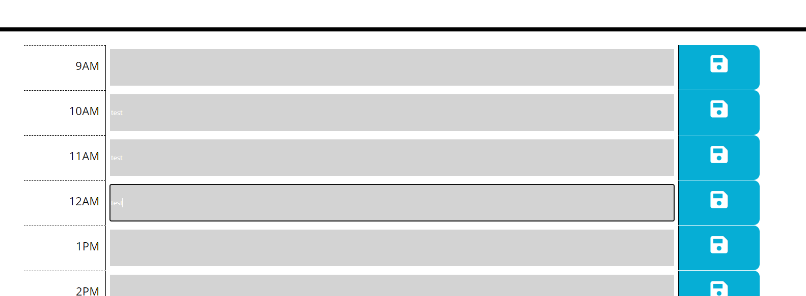

# Description

This project is a simple work day planner that lets users enter in tasks for different times of the workday. Users are also able to save the tasks they entered in local storage so that they may view the tasks later. The planner also will color code the tasks for the user, letting them know if the time slot is in the past, incipient, or in the future.

# Deploying

If you wish to view the project simply click on the link below the image. Feel free to pull the repository (also linked below) if you wish to view the codebase. Thanks and please reach out to the email listed at the end of the document with any questions!

# Image of website

# Link to website

https://kyler-mclachlan.github.io/Third-Party-APIs-Challenge-Work-Day-Scheduler/

# Link to Repository 

https://github.com/Kyler-Mclachlan/Third-Party-APIs-Challenge-Work-Day-Scheduler

# Contributors 
Kyler Mclachlan 

# Questions 

Any questions about the project may be sent to Kyler.mclachlan@gmail.com